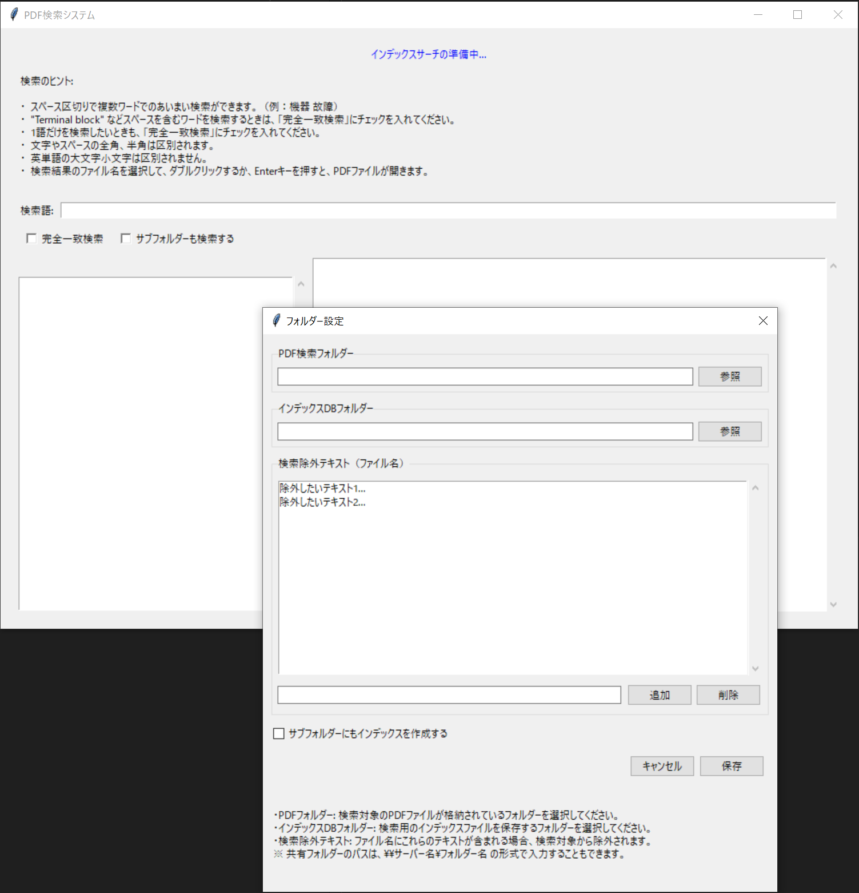

# PDF Search System (PDF検索システム)

[日本語](#japanese) |English

<a id="english"></a>

A user-friendly desktop application for quickly and efficiently searching through PDF file contents. Using indexing technology, you can rapidly find the information you need across multiple PDF documents.

## Features

- **Fast Search**: Instantly display search results using indexing
- **Flexible Search Options**: 
  - Fuzzy search (multiple keywords)
  - Exact match search
  - Subfolder search
- **Automatic Indexing**: Automatically detect and index new or updated PDF files
- **Filename Exclusion**: Exclude PDF files with specific text patterns in their filenames from search
- **Context Display**: View the text surrounding your search keywords
- **Save Results**: Export search results as a text file
- **Easy Configuration**: Set up search folders and index DB location via an intuitive UI

## Screenshots



[Insert application screenshots here]

## Requirements

- Python 3.7 or higher
- The following Python libraries:
  - tkinter
  - pdfplumber
  - pypdf

## Installation

```bash
# Clone the repository
git clone https://github.com/yourusername/pdf_indexer_searcher.git
cd pdf_indexer_searcher

# Install required libraries
pip install -r requirements.txt

# Run the application
python pdf_indexer_searcher.py
```

## Usage

1. **First Launch**:
   - Select the folder containing your PDF files
   - Choose a folder to store the index files
   - Optionally configure filename patterns to exclude from search

2. **Performing a Search**:
   - Enter your search terms
   - Optionally check "Exact Match Search" or "Include Subfolders" as needed
   - Click the "Search" button

3. **Viewing Results**:
   - Select a file from the list on the left
   - View file details and context on the right
   - Double-click or press Enter on a selected file to open the PDF

4. **Saving Results**:
   - Click "Save Results" to save a list of matching filenames to your desktop

## Customizing Settings

- From the **Settings menu**, you can modify:
  - PDF search folder
  - Index DB folder
  - Exclusion patterns
  - Subfolder indexing options

## How It Works

This application:

1. Extracts text from PDF files in the specified folder
2. Stores the extracted text in a SQLite database
3. Executes fast searches against the search query
4. Displays search results in real-time

## License

Released under the MIT License. See the [LICENSE](LICENSE) file for details.

## Contributing

Contributions of all kinds are welcome, including bug reports, feature requests, and pull requests.

## Author  

calico_blanket  
<https://x.com/calico_blanket>

## Note from the Author  

I am not a professional developer or software engineer, just a middle-aged woman who is an IT enthusiast.
This tool was created as a personal project with significant help from Claude's Sonnet 3.5 and 3.7.
If you provide feedback, bug reports, or suggestions, I will sincerely work on improvements with the help of Sonnet and knowledgeable community members.
I would appreciate your cooperation in my learning and growth

---

*Note: This application has been tested with Japanese and English PDF files, but may work with documents in other languages as well.*

# PDF検索システム

[英語](#english) |日本語

<a id="japanese"></a>

PDFファイルの内容を高速かつ効率的に検索するためのデスクトップアプリケーションです。インデックスを活用することで、複数のPDFファイルから必要な情報をすばやく見つけることができます。

## 特徴

- **高速検索**: インデックスを使用して瞬時に検索結果を表示
- **柔軟な検索オプション**:
  - あいまい検索（複数キーワード）
  - 完全一致検索
  - サブフォルダー検索
- **自動インデックス作成**: 新規・更新されたPDFファイルを自動検知してインデックスを更新
- **ファイル名除外機能**: ファイル名に特定のテキストパターンを含むPDFを検索対象から除外可能
- **検索コンテキスト表示**: 検索キーワードの前後のテキストを表示
- **結果の保存**: 検索結果一覧をテキストファイルとして保存可能
- **簡単な設定**: 直感的なUIで検索対象フォルダーとインデックスDBフォルダーを設定

## スクリーンショット


## 必要環境

- Python 3.7以上
- 以下のPythonライブラリ:
  - tkinter
  - pdfplumber
  - pypdf

## インストール方法

```bash
# リポジトリのクローン
git clone https://github.com/calico-blanket/pdf-search.git
cd pdf-search

# 必要なライブラリのインストール
pip install -r requirements.txt

# アプリケーションの実行
python pdf_indepdf-search.py
```

## 使用方法

1. **初回起動時**:
   - PDFファイルが格納されているフォルダーを選択
   - インデックスファイルを保存するフォルダーを選択
   - 必要に応じて検索から除外したいファイル名パターンを設定

2. **検索の実行**:
   - 検索語を入力
   - 必要に応じて「完全一致検索」や「サブフォルダーも検索する」オプションを選択
   - 「検索」ボタンをクリック

3. **結果の閲覧**:
   - 左側のリストから見たいファイルを選択
   - 右側に選択したファイルの詳細とコンテキストが表示される
   - 選択したファイルをダブルクリックまたはEnterキーを押すとPDFが開く

4. **検索結果の保存**:
   - 「結果を保存」ボタンをクリックすると、デスクトップに検索結果ファイル名の一覧が保存される

## 設定のカスタマイズ

- **設定メニュー**から、以下の設定を変更できます:
  - PDF検索フォルダー
  - インデックスDBフォルダー
  - 検索除外テキスト
  - サブフォルダーのインデックス作成オプション

## 仕組み

本アプリケーションは以下の処理を行います:

1. 指定フォルダー内のPDFファイルからテキストを抽出
2. 抽出テキストをSQLiteデータベースに保存
3. 検索クエリに対して高速検索を実行
4. 検索結果をリアルタイムで表示

## ライセンス

MITライセンスの下で公開されています。詳細は[LICENSE](LICENSE)ファイルをご覧ください。

## 貢献

バグ報告、機能リクエスト、プルリクエストなど、あらゆる形の貢献を歓迎します。

## 作者

calico_blanket (猫柄毛布）
<https://x.com/calico_blanket>

## 作者から

私はプロのデベロッパーやソフトエンジニアではなく、単なる、おばちゃんのIT愛好家にすぎません。
このツールは個人的なプロジェクトとして、ClaudeのSonnet3.7の助けを大きく借りて作成しました。
フィードバック、バグ報告、および提案などをいただきましたら、Sonnetと有識者の皆様のお知恵をお借りして、真摯に改善に取り組みたいと思います。
私の学びと成長ににご協力いただけると幸いです。

---

*注意: このアプリケーションは日本語と英語のPDFファイルでテスト済みですが、他の言語でも動作する可能性があります。*
