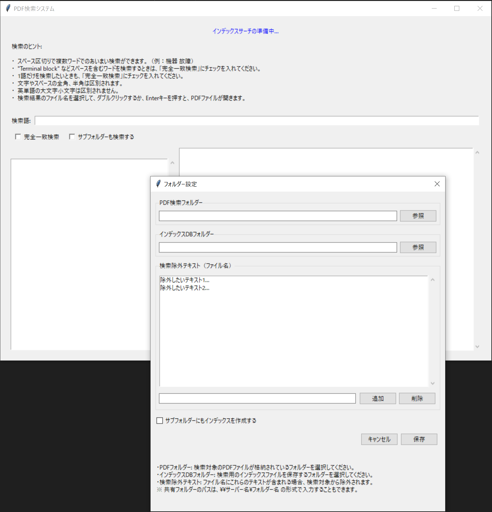

# PDF検索システム

PDFファイルの内容を高速かつ効率的に検索するためのデスクトップアプリケーションです。インデックスを活用することで、複数のPDFファイルから必要な情報をすばやく見つけることができます。

## 特徴

- **高速検索**: インデックスを使用して瞬時に検索結果を表示
- **柔軟な検索オプション**:
  - あいまい検索（複数キーワード）
  - 完全一致検索
  - サブフォルダー検索
- **自動インデックス作成**: 新規・更新されたPDFファイルを自動検知してインデックスを更新
- **ファイル名除外機能**: ファイル名に特定のテキストパターンを含むPDFを検索対象から除外可能
- **検索コンテキスト表示**: 検索キーワードの前後のテキストを表示
- **結果の保存**: 検索結果一覧をテキストファイルとして保存可能
- **簡単な設定**: 直感的なUIで検索対象フォルダーとインデックスDBフォルダーを設定

## スクリーンショット



## 必要環境

- Python 3.7以上
- 以下のPythonライブラリ:
  - tkinter
  - pdfplumber
  - pypdf

## インストール方法

```bash
# リポジトリのクローン
git clone https://github.com/calico-blanket/pdf-search.git
cd pdf-search

# 必要なライブラリのインストール
pip install -r requirements.txt

# アプリケーションの実行
python pdf_indepdf-search.py
```

## 使用方法

1. **初回起動時**:
   - PDFファイルが格納されているフォルダーを選択
   - インデックスファイルを保存するフォルダーを選択
   - 必要に応じて検索から除外したいファイル名パターンを設定

2. **検索の実行**:
   - 検索語を入力
   - 必要に応じて「完全一致検索」や「サブフォルダーも検索する」オプションを選択
   - 「検索」ボタンをクリック

3. **結果の閲覧**:
   - 左側のリストから見たいファイルを選択
   - 右側に選択したファイルの詳細とコンテキストが表示される
   - 選択したファイルをダブルクリックまたはEnterキーを押すとPDFが開く

4. **検索結果の保存**:
   - 「結果を保存」ボタンをクリックすると、デスクトップに検索結果ファイル名の一覧が保存される

## 設定のカスタマイズ

- **設定メニュー**から、以下の設定を変更できます:
  - PDF検索フォルダー
  - インデックスDBフォルダー
  - 検索除外テキスト
  - サブフォルダーのインデックス作成オプション

## 仕組み

本アプリケーションは以下の処理を行います:

1. 指定フォルダー内のPDFファイルからテキストを抽出
2. 抽出テキストをSQLiteデータベースに保存
3. 検索クエリに対して高速検索を実行
4. 検索結果をリアルタイムで表示

## ライセンス

MITライセンスの下で公開されています。詳細は[LICENSE](LICENSE)ファイルをご覧ください。

## 貢献

バグ報告、機能リクエスト、プルリクエストなど、あらゆる形の貢献を歓迎します。

## 作者

[あなたの名前]

---

*注意: このアプリケーションは日本語と英語のPDFファイルでテスト済みですが、他の言語でも動作する可能性があります。*
